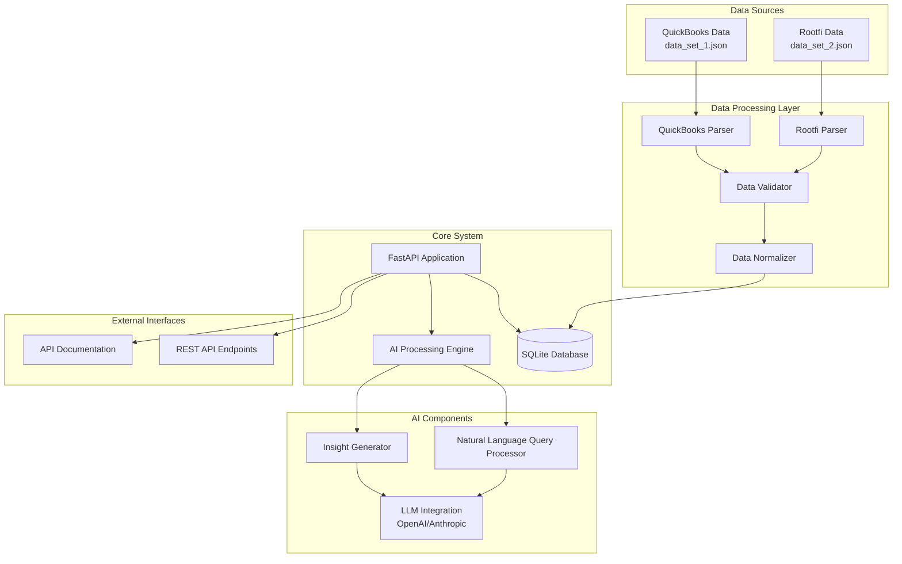

# Design Document

## Overview

The AI-powered financial data processing system is designed as a modern, scalable backend service that integrates diverse financial data sources into a unified platform with intelligent AI capabilities. The system follows a clean architecture pattern with clear separation of concerns, enabling robust data processing, natural language querying, and AI-powered financial insights.

The core architecture consists of data ingestion layers, a unified data model, RESTful APIs, and AI processing components that work together to provide a comprehensive financial analysis platform.

## Architecture

### High-Level Architecture



### Technology Stack

- **Backend Framework**: FastAPI (Python) - chosen for automatic API documentation, type hints, and async support
- **Database**: SQLite - simple setup for development, easily upgradeable to PostgreSQL for production
- **AI/LLM Integration**: OpenAI GPT-4 or Anthropic Claude - for natural language processing and insight generation
- **Data Processing**: Pydantic for data validation and serialization
- **Logging**: Python's built-in logging module with structured formatting
- **API Documentation**: FastAPI's automatic OpenAPI/Swagger documentation

## Components and Interfaces

### 1. Data Models

#### Unified Financial Record Model
```python
class FinancialRecord(BaseModel):
    id: str
    source: str  # 'quickbooks' or 'rootfi'
    period_start: date
    period_end: date
    currency: str
    revenue: Decimal
    expenses: Decimal
    net_profit: Decimal
    account_details: Dict[str, Any]
    created_at: datetime
    updated_at: datetime
```

#### Account Hierarchy Model
```python
class Account(BaseModel):
    account_id: str
    name: str
    account_type: str  # 'revenue', 'expense', 'asset', 'liability'
    parent_account_id: Optional[str]
    value: Decimal
    period: str
    source: str
```

### 2. Data Processing Components

#### QuickBooks Parser
- **Purpose**: Parse QuickBooks P&L report format with monthly columns
- **Input**: JSON with Header, Columns, and Rows structure
- **Output**: Normalized financial records
- **Key Features**:
  - Extract monthly data from column-based structure
  - Handle account hierarchies and groupings
  - Validate date ranges and currency information

#### Rootfi Parser
- **Purpose**: Parse Rootfi financial data with hierarchical line items
- **Input**: JSON array with detailed revenue/expense breakdowns
- **Output**: Normalized financial records
- **Key Features**:
  - Process nested line item structures
  - Extract account IDs and hierarchical relationships
  - Handle period-based data organization

#### Data Validator
- **Purpose**: Ensure data quality and consistency
- **Validation Rules**:
  - Numerical accuracy (no negative revenue unless justified)
  - Date consistency and non-overlapping periods
  - Account hierarchy integrity
  - Currency consistency
  - Balance equation verification (Revenue - Expenses = Net Profit)

### 3. API Layer

#### Core Endpoints

**Financial Data Endpoints**:
- `GET /api/v1/financial-data` - Retrieve financial records with filtering
- `GET /api/v1/financial-data/{period}` - Get data for specific period
- `GET /api/v1/accounts` - List all accounts with hierarchy
- `GET /api/v1/accounts/{account_id}` - Get specific account details

**AI-Powered Endpoints**:
- `POST /api/v1/query` - Natural language query processing
- `GET /api/v1/insights/{period}` - Generate AI insights for period
- `POST /api/v1/compare` - Compare financial performance between periods
- `GET /api/v1/trends/{metric}` - Analyze trends for specific metrics

**System Endpoints**:
- `GET /api/v1/health` - System health check
- `POST /api/v1/data/ingest` - Trigger data ingestion process
- `GET /api/v1/data/status` - Check data processing status

### 4. AI Processing Engine (Agentic Architecture)

#### AI Agent with Tool Calling
- **Purpose**: Intelligent agent that uses function calling to interact with financial data
- **Architecture**: LLM-powered agent with access to specialized financial tools
- **Tool Categories**:
  - Data retrieval tools (get_revenue, get_expenses, get_profit_by_period)
  - Analysis tools (calculate_growth_rate, compare_periods, detect_trends)
  - Calculation tools (sum_by_category, calculate_ratios, aggregate_by_timeframe)

#### Financial Data Tools
```python
# Example tool definitions for the AI agent
@tool
def get_revenue_by_period(start_date: str, end_date: str, account_type: str = None) -> Dict:
    """Retrieve revenue data for specified period and optional account type"""
    
@tool  
def compare_financial_metrics(period1: str, period2: str, metrics: List[str]) -> Dict:
    """Compare specific financial metrics between two periods"""
    
@tool
def calculate_growth_rate(metric: str, periods: List[str]) -> Dict:
    """Calculate growth rates for a metric across multiple periods"""
    
@tool
def detect_anomalies(metric: str, threshold: float = 0.2) -> List[Dict]:
    """Detect unusual patterns or anomalies in financial data"""
```

#### Natural Language Query Processor
- **Purpose**: Interpret user queries and determine which tools to use
- **Components**:
  - Query understanding and intent classification
  - Tool selection and parameter extraction
  - Multi-step reasoning for complex queries
  - Response synthesis from tool results

#### Agentic Workflow
1. **Query Analysis**: LLM analyzes user query to understand intent
2. **Tool Planning**: Agent determines which tools to call and in what order
3. **Tool Execution**: Agent calls appropriate financial data tools
4. **Result Synthesis**: Agent combines tool results into coherent response
5. **Response Generation**: Agent generates natural language response with insights

#### LLM Integration Layer
- **Purpose**: Interface with external LLM services for agentic behavior
- **Features**:
  - Function calling support (OpenAI functions or Anthropic tool use)
  - Multi-turn conversation handling
  - Tool result interpretation and chaining
  - Error handling and tool retry logic
  - Context management for complex queries

## Data Models

### Database Schema

#### financial_records table
```sql
CREATE TABLE financial_records (
    id TEXT PRIMARY KEY,
    source TEXT NOT NULL,
    period_start DATE NOT NULL,
    period_end DATE NOT NULL,
    currency TEXT NOT NULL,
    revenue DECIMAL(15,2) NOT NULL,
    expenses DECIMAL(15,2) NOT NULL,
    net_profit DECIMAL(15,2) NOT NULL,
    raw_data JSON,
    created_at TIMESTAMP DEFAULT CURRENT_TIMESTAMP,
    updated_at TIMESTAMP DEFAULT CURRENT_TIMESTAMP
);
```

#### accounts table
```sql
CREATE TABLE accounts (
    account_id TEXT PRIMARY KEY,
    name TEXT NOT NULL,
    account_type TEXT NOT NULL,
    parent_account_id TEXT,
    source TEXT NOT NULL,
    FOREIGN KEY (parent_account_id) REFERENCES accounts(account_id)
);
```

#### account_values table
```sql
CREATE TABLE account_values (
    id INTEGER PRIMARY KEY AUTOINCREMENT,
    account_id TEXT NOT NULL,
    financial_record_id TEXT NOT NULL,
    value DECIMAL(15,2) NOT NULL,
    FOREIGN KEY (account_id) REFERENCES accounts(account_id),
    FOREIGN KEY (financial_record_id) REFERENCES financial_records(id)
);
```

### Data Flow Architecture

1. **Ingestion Phase**:
   - Raw JSON files are processed by source-specific parsers
   - Data validation ensures quality and consistency
   - Normalized data is stored in unified schema

2. **Query Phase**:
   - API requests trigger data retrieval from database
   - AI queries are processed through NLP pipeline
   - Results are formatted and returned with appropriate context

3. **Insight Generation Phase**:
   - Background processes analyze data for patterns
   - AI generates narrative insights and summaries
   - Results are cached for improved performance

## Error Handling

### Error Categories and Strategies

#### Data Processing Errors
- **Validation Failures**: Log detailed error with data context, continue processing valid records
- **Parsing Errors**: Implement fallback parsers, flag problematic records for manual review
- **Database Errors**: Implement transaction rollback, retry with exponential backoff

#### AI Processing Errors
- **LLM API Failures**: Implement circuit breaker pattern, provide cached or simplified responses
- **Query Interpretation Errors**: Ask clarifying questions, provide suggested alternatives
- **Timeout Handling**: Implement async processing with progress indicators

#### System Errors
- **Database Connection Issues**: Connection pooling with health checks, automatic reconnection
- **Memory/Performance Issues**: Implement pagination, streaming responses, resource monitoring
- **Configuration Errors**: Validate configuration on startup, provide clear error messages

### Logging Strategy

- **Structured Logging**: Use JSON format with consistent field names
- **Log Levels**: DEBUG for development, INFO for operations, WARNING for recoverable issues, ERROR for failures
- **Context Preservation**: Include request IDs, user context, and operation traces
- **Performance Logging**: Track response times, database query performance, AI processing duration

## Testing Strategy

### Unit Testing
- **Data Parsers**: Test with various input formats and edge cases
- **Validation Logic**: Verify all validation rules with positive and negative test cases
- **API Endpoints**: Test all endpoints with various input combinations
- **AI Components**: Mock LLM responses to test processing logic

### Integration Testing
- **Database Operations**: Test complete data flow from ingestion to retrieval
- **AI Pipeline**: Test end-to-end natural language query processing
- **API Integration**: Test complete request/response cycles

### Performance Testing
- **Load Testing**: Simulate concurrent users and measure response times
- **Data Volume Testing**: Test with large datasets to ensure scalability
- **AI Performance**: Measure LLM response times and optimize prompts

### Data Quality Testing
- **Validation Testing**: Verify data quality rules catch all error conditions
- **Consistency Testing**: Ensure data consistency across different sources
- **Accuracy Testing**: Validate financial calculations and account reconciliation