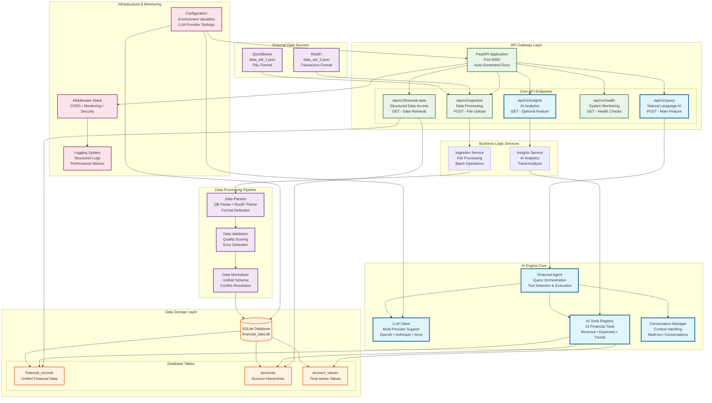

# AI Financial Data System - Architecture Diagram

## Complete System Architecture



## Data Flow Explanation

### **1. Data Ingestion Flow**
```
QuickBooks/RootFi JSON → Ingestion API → Parser → Validator → Normalizer → Database
```

### **2. Natural Language Query Flow**
```
User Query → API → Financial Agent → LLM + Tools → Database → AI Response
```

### **3. Structured Data Access Flow**
```
API Request → Financial Data Endpoint → Database Query → Formatted Response
```

### **4. AI Insights Generation Flow**
```
Insights Request → Insights Service → AI Tools → Data Analysis → Generated Insights
```

## Key Architectural Decisions

### **AI-First Design**
- Natural language querying as the primary interface
- LLM integration with specialized financial tools
- Context-aware conversation management

### **Multi-Provider LLM Support**
- Flexible backend supporting OpenAI, Anthropic, and Groq
- Provider-agnostic tool calling interface
- Graceful fallback and error handling

### **Modular Data Processing**
- Separate parsers for each data source format
- Validation layer for data quality assurance
- Normalization for unified data representation

### **Production-Ready Architecture**
- Error handling and logging
- Health monitoring and performance metrics
- Scalable database design with proper indexing

## Component Responsibilities

| Component | Responsibility | Key Features |
|-----------|---------------|--------------|
| **Financial Agent** | Query orchestration and tool selection | Context awareness, multi-turn conversations |
| **LLM Client** | AI provider abstraction | Multi-provider support, error handling |
| **AI Tools Registry** | Financial analysis capabilities | 13 specialized tools, data access |
| **Data Parsers** | Source-specific data processing | QuickBooks P&L, RootFi transactions |
| **Validation Engine** | Data quality assurance | Quality scoring, error detection |
| **Ingestion Service** | File processing coordination | Batch operations, status tracking |

---