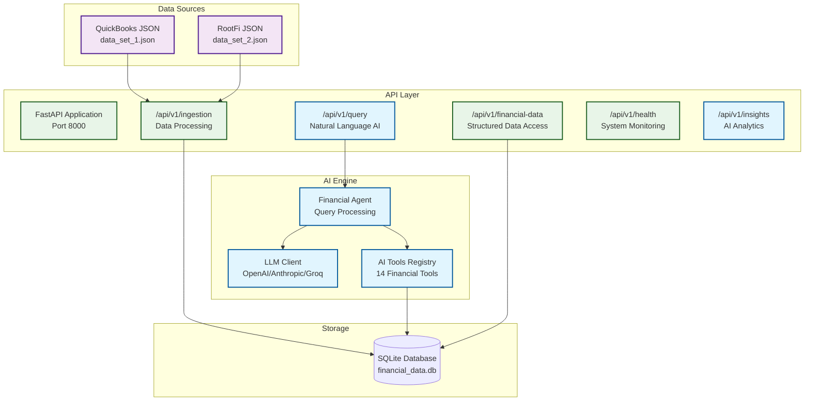

# AI Financial Data System

**AI Engineer x Kudwa Take-Home Test Solution**

An intelligent financial data processing system that demonstrates expertise in AI/ML integration, backend architecture, and API design. This system integrates diverse financial data sources (QuickBooks, Rootfi) into a unified backend with powerful AI capabilities for natural language querying and intelligent insights generation.

## Assignment Requirements Met

### ✅ **Core Requirements**
- **Backend Architecture**: FastAPI with SQLite database
- **Data Integration**: QuickBooks and Rootfi JSON parsing and unification  
- **API Design**: RESTful endpoints with comprehensive documentation
- **AI Integration A**: Natural language querying with LLM integration *(Mandatory)*
- **AI Integration B**: Advanced analytics and insights generation *(Optional)*
- **Data Processing**: Validation, normalization, and quality checks
- **Technical Quality**: Clean architecture with proper error handling

### **Key Features Implemented**

#### **Natural Language AI Querying**
```bash
POST /api/v1/query
{
  "query": "What was the total profit in Q1 2024?",
  "conversation_id": "optional_context"
}
```

**Example Queries Supported:**
- "Show me revenue trends for 2024"
- "Which expense category had the highest increase this year?"
- "Compare Q1 and Q2 performance"
- "What are the seasonal patterns in our revenue?"

#### **Multi-Source Data Integration**
- **QuickBooks**: Processes `data_set_1.json` format
- **RootFi**: Processes `data_set_2.json` format
- **Unified Storage**: Normalized database schema
- **Data Validation**: Quality checks and error handling

#### **AI-Powered Analytics**
- Revenue trend analysis with intelligent narratives
- Expense pattern detection and recommendations  
- Seasonal analysis across multiple years
- Cash flow insights and financial health scoring

## System Architecture



## Technology Stack

- **Backend**: FastAPI (Python 3.12)
- **Database**: SQLite with SQLAlchemy ORM
- **AI/ML**: OpenAI GPT-5/GPT-4, Anthropic Claude, Groq
- **Data Processing**: Custom parsers with validation
- **Deployment**: Render.com + Docker support

## API Endpoints

| Endpoint | Method | Purpose | Status |
|----------|--------|---------|--------|
| `/api/v1/query` | POST | Natural language AI queries | ✅ Core |
| `/api/v1/financial-data` | GET | Structured data access | ✅ Core |
| `/api/v1/ingestion/file` | POST | Single file processing | ✅ Core |
| `/api/v1/ingestion/batch` | POST | Batch file processing | ✅ Core |
| `/api/v1/health` | GET | System health monitoring | ✅ Core |
| `/api/v1/insights/*` | GET | AI-powered analytics | ✅ Optional |

## Quick Start

### 1. **Setup Environment**
```bash
# Clone repository
git clone <https://github.com/BahaaKaaki/FinanceAI-Hub.git>

# Install dependencies
pip install -r requirements.txt

# Set LLM API key (choose one)
export OPENAI_API_KEY="key-here"
export ANTHROPIC_API_KEY="key-here"  
export GROQ_API_KEY="key-here"
```

### 2. **Start Server**
```bash
# Development server
python -m uvicorn app.main:app --host 0.0.0.0 --port 8000 --reload

# Production (not really) server
python -m uvicorn app.main:app --host 0.0.0.0 --port 8000
```

### 3. **Test System**
```bash
# Run API tests
python test_api_endpoints.py

# Test ingestion
python test_ingestion.py

# Test AI queries
python test_ingestion_api.py
```

## Usage Examples

### **Natural Language Queries**
```bash
curl -X POST "http://localhost:8000/api/v1/query" \
  -H "Content-Type: application/json" \
  -d '{
    "query": "What was the total revenue in Q3 2024?",
    "max_iterations": 5
  }'
```

### **Data Ingestion**
```bash
curl -X POST "http://localhost:8000/api/v1/ingestion/batch" \
  -H "Content-Type: application/json" \
  -d '{
    "file_paths": ["data_set_1.json", "data_set_2.json"]
  }'
```

### **Structured Data Access**
```bash
curl "http://localhost:8000/api/v1/financial-data?source=quickbooks&period_start=2024-01-01"
```

## Testing & Validation

### **API Testing**
- **Postman Collection**: `AI_Financial_System_Collection.json`
- **Automated Tests**: `test_api_endpoints.py`

### **AI Testing**
- Natural language query validation
- Tool integration testing
- Conversation context handling
- Error scenario testing

## Documentation

- **System Overview**: `SYSTEM_OVERVIEW.md` - Comprehensive technical documentation
- **API Reference**: Available at `http://localhost:8000/docs` (FastAPI auto-docs)
- **Deployment Guide**: `RENDER_DEPLOYMENT_GUIDE.md`
- **Provider Setup**: `PROVIDER_GUIDE.md`

## 🚀 Deployment

### **Local Development**
```bash
python -m uvicorn app.main:app --reload
```

### **Production (Render.com)**
- Configured with `render.yaml`
- Automatic deployments from Git
- Environment variables for API keys

### **Docker**
```bash
docker build -t ai-financial-system .
docker run -p 8000:8000 ai-financial-system
```

## Assignment Compliance

### **Deliverables Provided**
- ✅ **Working AI-Powered Backend System**
- ✅ **Complete API with Natural Language Support**
- ✅ **Advanced Analytics Features**
- ✅ **Clean Code Repository with README**
- ✅ **Technical Documentation**
- ✅ **Demo-Friendly Deployed System**

### **Key Differentiators**
1. **AI-First Design**: Natural language as primary interface
2. **Production Ready**: Error handling and monitoring
3. **Multi-Provider LLM**: Flexible AI backend (OpenAI/Anthropic/Groq)
4. **Intelligent Tool Calling**: 13 specialized financial analysis tools
5. **Context-Aware**: Conversation memory for follow-up questions
6. **Scalable Architecture**: Clean separation of concerns

---