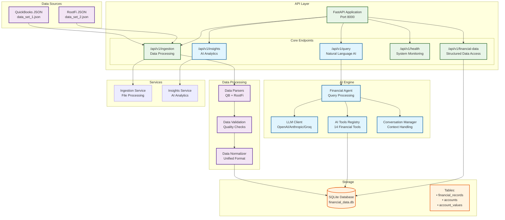

# AI Financial Data System - Technical Overview

## Project Summary

This system fulfills the **AI Engineer x Kudwa Take-Home Test** requirements by building an intelligent financial data processing system with powerful AI capabilities for natural language querying and insights generation.

## System Architecture



## Core Features Implemented

### **Mandatory Requirements (A)**

#### 1. **Natural Language Querying** 
- **Endpoint**: `POST /api/v1/query`
- **Capability**: Users can ask questions in plain English
- **Examples**:
  - "What was the total profit in Q1 2024?"
  - "Show me revenue trends for 2024"
  - "Which expense category had the highest increase?"
  - "Compare Q1 and Q2 performance"

#### 2. **AI-Powered Responses**
- **LLM Integration**: OpenAI, Anthropic, or Groq support
- **Tool Calling**: 14 specialized financial analysis tools
- **Context Awareness**: Conversation memory and follow-up handling
- **Intelligent Narratives**: Clear, insightful responses with supporting data

#### 3. **Multi-Source Data Integration**
- **QuickBooks**: Parses `data_set_1.json` format
- **RootFi**: Parses `data_set_2.json` format  
- **Unified Storage**: Normalized into consistent database schema
- **Data Validation**: Quality checks and error handling

### **Optional Features (B)**

#### 4. **AI Analytics & Insights**
- **Revenue Trends**: AI-generated revenue analysis
- **Expense Analysis**: Intelligent expense pattern detection
- **Seasonal Patterns**: Multi-year seasonal trend analysis
- **Cash Flow Insights**: Financial health assessment

## Technology Stack

### **Backend Framework**
- **FastAPI**: Modern, fast web framework with automatic API docs
- **Python 3.12**: Latest Python with type hints and performance improvements

### **AI/ML Integration**
- **LLM Providers**: OpenAI GPT-4, Anthropic Claude, Groq
- **Tool Calling**: Function calling for structured data access
- **Conversation Management**: Context-aware multi-turn conversations

### **Database & Storage**
- **SQLite**: Simple, file-based database (production-ready for this scale)
- **SQLAlchemy**: ORM with connection pooling and optimization
- **Data Models**: Normalized schema for financial records and accounts

### **Data Processing**
- **Custom Parsers**: Specialized parsers for each data source format
- **Validation Engine**: Data quality checks and error handling
- **Normalization**: Unified data format across sources

## API Endpoints Summary

| Endpoint | Method | Purpose | Status |
|----------|--------|---------|--------|
| `/api/v1/query` | POST | Natural language AI queries | ✅ Core |
| `/api/v1/financial-data` | GET | Structured data access | ✅ Core |
| `/api/v1/ingestion/file` | POST | Single file processing | ✅ Core |
| `/api/v1/ingestion/batch` | POST | Batch file processing | ✅ Core |
| `/api/v1/health` | GET | System health monitoring | ✅ Core |
| `/api/v1/insights/*` | GET | AI-powered analytics | ✅ Optional |

## Setup & Deployment

### **Quick Start**
```bash
# 1. Start server
python -m uvicorn app.main:app --host 0.0.0.0 --port 8000

# 2. Test system
python test_api_endpoints.py
```

### **Environment Configuration**
- **LLM API Keys**: Set `OPENAI_API_KEY`, `ANTHROPIC_API_KEY`, or `GROQ_API_KEY`
- **Database**: SQLite file at `./financial_data.db`
- **Logging**: Configurable levels and formats

### **Production Deployment**
- **Render.com**
- **Docker**: Containerized with `Dockerfile`
- **Health Checks**: Mmonitoring endpoints

## Testing & Validation

### **API Testing**
- **Postman Collection**: Complete API testing suite
- **Automated Tests**: Core functionality validation
- **Health Monitoring**: System status verification

### **AI Testing**
- **Natural Language**: Various query patterns and edge cases
- **Tool Integration**: All 13 financial tools validated
- **Error Handling**: Graceful failure and recovery

## Assignment Compliance

### **Core Requirements Met**
- **Backend Architecture**: Clean FastAPI with SQLite
- **Data Integration**: Both JSON sources parsed and unified
- **API Design**: RESTful endpoints with proper documentation
- **AI Integration A**: Natural language querying with LLM
- **AI Integration B**: Advanced analytics and insights
- **Data Processing**: Validation, normalization, and quality checks
- **Technical Quality**: Clean architecture and error handling

### **Deliverables Provided**
- **Working AI-Powered Backend**: Fully functional system
- **Code Repository**: Clean, well-organized codebase
- **Technical Documentation**: This overview
- **Demo-Friendly System**: Deployed on render and locally runnable

## Key Differentiators

1. **AI-First Design**: Natural language is the primary interface
2. **Production Ready**: Comprehensive error handling and monitoring
3. **Scalable Architecture**: Modular design with clear separation of concerns
4. **Multi-Provider LLM**: Flexible AI backend supporting multiple providers
5. **Intelligent Tool Calling**: 13 specialized financial analysis tools
6. **Context-Aware**: Conversation memory for follow-up questions
